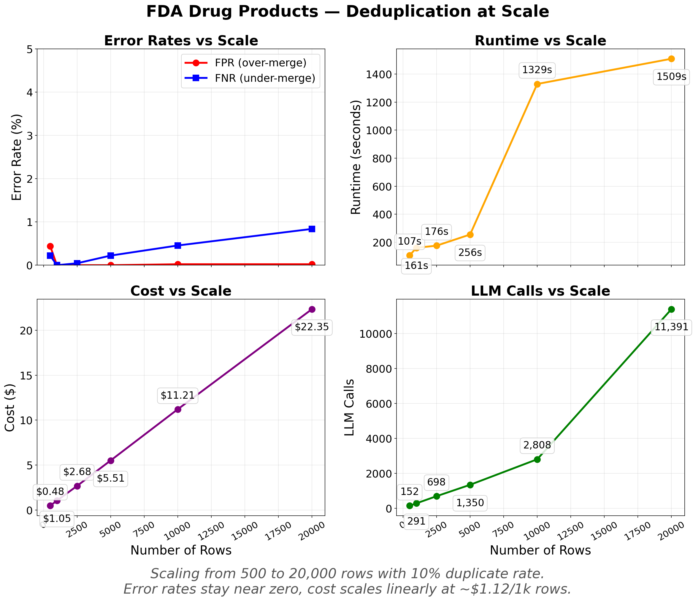

# How to Scale LLM Deduplication to 20,000 Rows

LLM-powered deduplication gives you semantic understanding that string matching can't, but naive pairwise comparison is quadratic. At 20,000 rows that's 200 million pairs. Everyrow's dedupe pipeline uses a funnel of embeddings, clustering, and targeted LLM calls to keep cost linear and accuracy high.



Error rates stay near zero as scale increases. Cost and LLM calls scale linearly. Runtime is under 5 minutes up to 10,000 rows and 25 minutes at 20,000.

## Install

```bash
pip install everyrow
export EVERYROW_API_KEY=your_key_here  # Get one at everyrow.io/api-key
```

## Running a large dedupe

```python
import asyncio
import pandas as pd
from everyrow.ops import dedupe

data = pd.read_csv("fda_products.csv")

async def main():
    result = await dedupe(
        input=data,
        equivalence_relation=(
            "Same ingredient + same strength + same applicant "
            "+ same dosage form = duplicate"
        ),
    )

    clean = result.data[result.data["selected"] == True]
    print(f"Reduced {len(data)} to {len(clean)} unique records")
    clean.to_csv("deduplicated.csv", index=False)

asyncio.run(main())
```

## Cost at different scales

Cost stays between $0.90 and $1.50 per 1,000 rows across all datasets we tested:

| Dataset                | Entity      | Rows   | Dup% | F1    | Cost   | $/1k rows |
| ---------------------- | ----------- | ------ | ---- | ----- | ------ | --------- |
| Small Companies        | company     | 200    | 8%   | 1.000 | $0.18  | $0.90     |
| Medium People          | person      | 1,000  | 20%  | 0.994 | $1.18  | $1.18     |
| Medium Transactions    | transaction | 1,000  | 20%  | 0.945 | $1.41  | $1.41     |
| Large Companies (Messy)| company     | 3,000  | 10%  | 0.974 | $3.21  | $1.07     |
| Large Products (FDA)   | product     | 5,000  | 5%   | 0.997 | $6.37  | $1.27     |
| Company Names          | company     | 8,628  | 10%  | 0.976 | $12.58 | $1.46     |
| FDA Products           | product     | 20,000 | 10%  | 0.996 | $22.40 | $1.12     |

The transaction dataset costs the most per row ($1.41/1k) because property records have ambiguous overlap, producing larger clusters. Structured data like FDA products is cheaper ($1.12/1k).

Rough formula: **$1-1.50 per 1,000 rows** depending on data complexity.

## The two error modes

Every deduplication system makes two kinds of mistakes:

**Over-merging (low Precision):** Distinct entities incorrectly grouped together. This is data loss — you destroy real records. The dangerous failure mode.

**Under-merging (low Recall):** True duplicates missed. Your data stays messy, but nothing is lost. The safe failure mode.

At 20,000 rows, Precision is 1.000 (zero false merges) while Recall is 0.992 (8 of ~2,000 duplicates were missed). The system only merges when it's confident.

## Writing good equivalence rules

The `equivalence_relation` parameter is the single most important input. It's a natural language description of what makes two rows "the same thing."

**Be specific.** Enumerate the fields that must match:

```python
# Good: mentions all matching fields
equivalence_relation="Same ingredient + same strength + same applicant + same dosage form = duplicate"

# Less good: vague
equivalence_relation="Same drug"
```

**Be explicit about edge cases.** If "VIRTU FINANCIAL INC CLASS A" and "VIRTU FINANCIAL INC" should or shouldn't match, say so. If career changes mean the same person can appear at different organizations, state that:

```python
equivalence_relation=(
    "Two rows are duplicates if they represent the same person "
    "despite different email/organization (career changes). "
    "Consider name variations like typos, nicknames, and format differences."
)
```

**Keep it short.** One or two sentences. The rule goes into every LLM call, so verbosity costs tokens.

## Testing on different entity types

We validated across companies, people, products, and transactions to make sure the pipeline generalizes:

- **FDA drug products (20k rows):** F1 = 0.996. Structured data with multi-field matching. Easiest for the pipeline.
- **Company names (8.6k rows):** F1 = 0.976. Single-column matching with only a name to work with. Requires semantic judgment.
- **People (1k rows):** F1 = 0.994. Name variations, career changes, multiple identifiers.
- **Transactions (1k rows):** F1 = 0.945. Property records with ambiguous addresses and shared parcel IDs. Hardest dataset.

The transaction dataset is the hardest because the same address can appear in different formats and adjacent properties share identifiers. Even here, F1 is above 0.94.

## Related

- [How to Resolve Duplicate Entities in Python](/resolve-entities-python) — 500-row CRM walkthrough
- [How to Deduplicate Training Data in Python](/deduplicate-training-data-ml) — semantic deduplication for ML datasets
- [API reference](/reference/DEDUPE)
